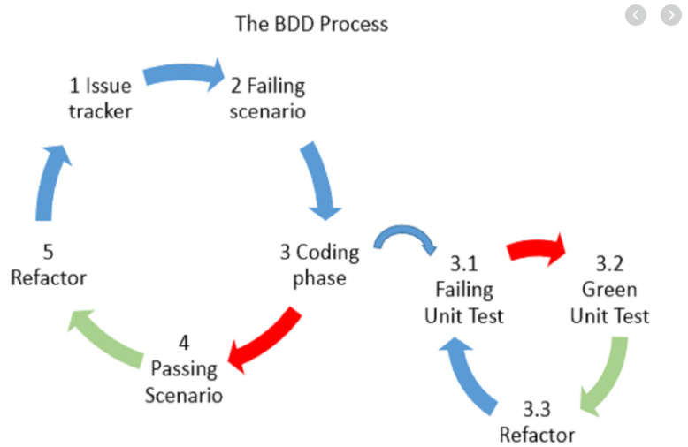

## Inleiding

In het softwareontwikkelingsproces is het cruciaal om te valideren of een systeem voldoet aan de oorspronkelijke specificaties en verwachtingen van de klant. Acceptatietesten spelen hierbij een cruciale rol.

## V-Model en Testfasen

Het V-model illustreert de verschillende testfasen in softwareontwikkeling:
- **Unit Testing**: Testen van individuele componenten
- **Integratie Testing**: Valideren van samenwerking tussen modules
- **Acceptatie Testing**: Controleren of het systeem aan de klantspecificaties voldoet

## Behavior-Driven Development (BDD)

### De Three Amigos

BDD, geïntroduceerd door Dan North in 2006, benadrukt samenwerking tussen:
- Business stakeholders
- Ontwikkelaars
- Testers

### BDD Cyclus

1. Specificeren van gedrag
2. Automatiseren van scenario's
3. Implementeren van code
4. Refactoring



## Specification by Example

In plaats van gedetailleerde systeembeschrijvingen, gebruikt BDD:
- Concrete voorbeelden
- Scenario's die het gewenste gedrag illustreren
- Gherkin-taal voor specificaties

### Gherkin: Een Gemeenschappelijke Taal

Gherkin biedt een gestructureerde manier om scenario's te beschrijven:
- Begrijpelijk voor alle stakeholders
- Automatisch testbaar
- Ondersteunt communicatie

Voorbeeld:
```gherkin
Feature: Rekenmachine
    Als gebruiker
    Wil ik basale berekeningen kunnen uitvoeren
    Zodat ik eenvoudige wiskundige bewerkingen kan doen

Scenario: Twee getallen optellen
    Given de eerste waarde is 5
    And de tweede waarde is 7
    When ik de getallen optел
    Then is het resultaat 12
```

## Belang van Automatisering

Handmatig testen is:
- Tijdrovend
- Foutgevoelig
- Niet schaalbaar

Automatische acceptatietesten bieden:
- Snelle feedbackcyclus
- Consistente testuitvoering
- Mogelijkheid tot regressietesten

## Tools voor BDD

- Reqnroll (voorheen SpecFlow)
- Cucumber
- JBehave

## Conclusie

BDD en acceptatietesten vormen een essentieel onderdeel van moderne softwareontwikkeling. Ze overbruggen de communicatiekloof tussen technische en niet-technische stakeholders en garanderen dat software voldoet aan de verwachtingen.