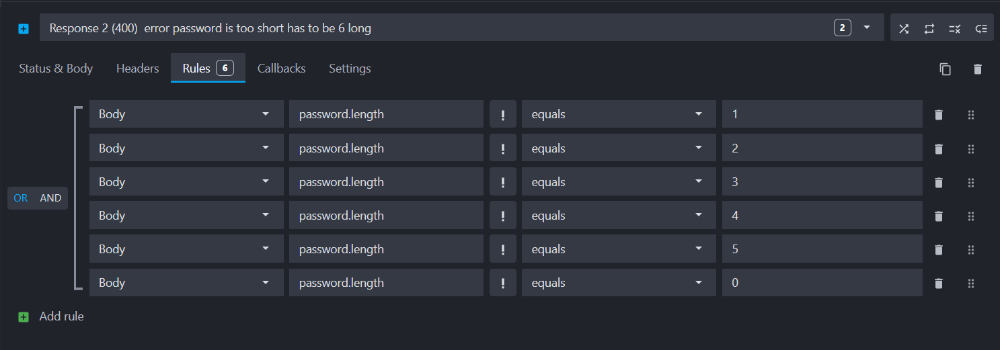

## Mockoon: Gedetailleerde Uitleg

### Installatie Opties

1. **GUI Applicatie**
   - Download via: [Mockoon Download Link](https://mockoon.com/download/)
   - Grafische interface voor eenvoudige API mock configuratie

2. **NPM CLI**
   ```sh
   $ npm install -g @mockoon/cli
   $ mockoon-cli start --data ./data-file.json
   ```

3. **Docker**
   ```sh
   $ docker run -d --mount type=bind,source=/data-file.json,target=/data,readonly -p 3000:3000 mockoon/cli:latest -d data -p 3000
   ```

### GitHub Actions Voorbeeld
```yml
- name: Run Mockoon CLI
  uses: mockoon/cli-action@v2
  with:
    version: "latest"
    data-file: "./mockoon-data.json"
    port: 3000
- name: Test Aanroep
  run: curl -X GET http://localhost:3000/endpoint
```

### Faker.js Integratie

Mockoon ondersteunt Faker.js voor dynamische data generatie. Enkele voorbeelden:

```json
{{faker 'location.zipCode'}}
{{faker 'person.firstName'}}
{{faker 'number.int' min=10 max=100}}
```

#### Faker Methoden
- `location.zipCode`: Willekeurige postcode
- `person.firstName`: Willekeurige voornaam
- `number.int`: Willekeurig geheel getal
- `internet.email`: Gegenereerd e-mailadres

### Variabelen in Mockoon

Mockoon biedt verschillende variabele helpers:
- `setVar`: Lokale variabele instellen
- `getVar`: Lokale variabele ophalen
- `setGlobalVar`: Globale variabele instellen
- `getGlobalVar`: Globale variabele ophalen
- `getEnvVar`: Omgevingsvariabele ophalen

### Rules


Mockoon ondersteunt geavanceerde rules voor dynamische responses:
- Voorwaardelijke responses
- JSONPath query's
- Filtering op headers/body

### JSONPath Voorbeelden

```json
{
  "store": {
    "book": [
      { 
        "category": "reference",
        "author": "Nigel Rees",
        "title": "Sayings of the Century",
        "price": 8.95
      }
    ]
  }
}
```

- `$.store.book[*].author`: Alle auteurs ophalen
- `$.store.book[0].title`: Eerste boektitel
- `..author`: Alle auteurs vinden

### JWT Ondersteuning

Mockoon biedt helpers voor JWT token manipulatie:
- `jwtPayload`: Payload eigenschappen extraheren
- `jwtHeader`: Header eigenschappen extraheren

Voorbeeld:
```json
{{jwtPayload (header 'Authorization') 'sub'}}
```

## Best Practices

1. Gebruik gedetailleerde mock definities
2. Genereer dynamische testdata
3. Simuleer verschillende response scenario's
4. Maak gebruik van voorwaardelijke routes
5. Test randgevallen en foutscenario's