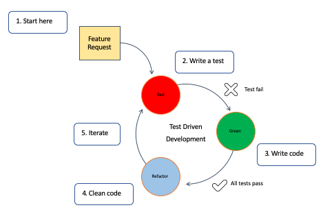

## Wat
TDD staat voor test driven development. wat betekent dat je eerst de testen ga schrijven voor dat je de code gaat schcrijven. eerst denken wat je gaat testen voor dat je de code gaat schrijven dit heeft wat voordelen en nadelen.

### voordelen
- **1** Vermindert werk voor de manuele testers
- **2** Vermindert het aantal fouten in de code
- **3** Geeft een niveau van correctheid
- **4** Neemt de angst van refactoren weg
- **5** Zorgt voor beter architectuur
- **6** Zorgt voor snellere ontwikkeling

### nadelen
- **1** Vraagt meer tijd dus de kost ligt hoger
- **2** Het correct testen is moeilijk
- **3** Wanneer er iets verranderd moeten de testen ook verranderen

## Hoe

Wanneer we een feature moeten toevoegen starten we met de testen te schrijven, die test faalt want er is nog geen productie code. daarna schrijven we de productie code. vervolgend testen we de code, slaagt deze goed dan kunnen we gaan refactoren waar nodig anders is de code productie klaar.