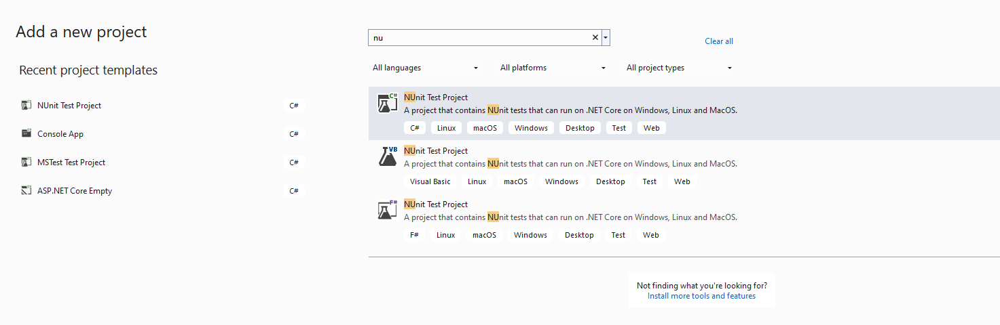
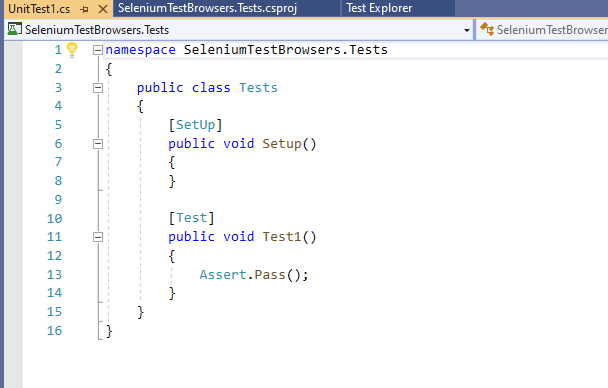
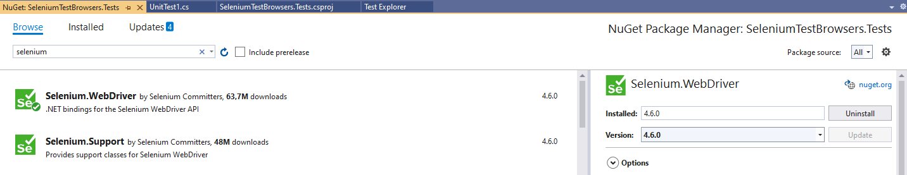

## Selenium: UI Testing van Websites

### 1. Voorbereiding

#### 1.1 Project Aanmaken

1. Open Visual Studio 2022
2. Maak een nieuw Console App (.NET Core) project aan
3. Noem het project `SeleniumTestBrowsers`



#### 1.2 NUnit Test Project Toevoegen

1. Klik rechts op de solution in Solution Explorer
2. Selecteer 'Add' → 'New Project'
3. Maak een NUnit Test Project aan
4. Noem het project `SeleniumTestBrowsers.Tests`



### 2. Selenium WebDriver Installatie

#### 2.1 NuGet Packages Installeren

1. Open NuGet Package Manager
2. Zoek naar 'Selenium'
3. Installeer `Selenium.WebDriver`
4. Kies de laatste stabiele versie



#### 2.2 Browser WebDrivers Downloaden

| Browser | Download Link |
|---------|--------------|
| Firefox | https://github.com/mozilla/geckodriver/releases |
| Chrome | http://chromedriver.chromium.org/downloads |
| Internet Explorer | https://github.com/SeleniumHQ/selenium/wiki/InternetExplorerDriver |
| Edge | https://blogs.windows.com/msedgedev/2015/07/23/bringing-automated-testing-to-microsoft-edge-through-webdriver/ |
| Opera | https://github.com/operasoftware/operachromiumdriver/releases |

##### WebDriver Plaatsing
- Zelfde map als browser executable
- Aparte map (bijv. `c:\Webdrivers`)

### 3. Eerste Selenium Test

#### 3.1 Browser Operations Helper Klasse

```csharp
public class BrowserOperations
{
    private IWebDriver webDriver;

    public BrowserOperations(IWebDriver webDriver)
    {
        this.webDriver = webDriver;
    }

    public void InitBrowser()
    {
        webDriver.Manage().Window.Maximize();
    }

    public string Title => webDriver.Title;
    public IWebDriver WebDriver => webDriver;

    public void Goto(string url)
    {
        webDriver.Url = url;
    }

    public void Close()
    {
        webDriver.Quit();
    }
}
```

#### 3.2 Testcase: DuckDuckGo Zoekopdracht

```csharp
[TestFixture(Description = "Chrome Zoekopdracht Test")]
public class ZoekopdrachtTest
{
    private BrowserOperations browser;

    [SetUp]
    public void Setup()
    {
        // Let op: Pas het pad aan indien WebDriver in een andere map staat
        browser = new BrowserOperations(new ChromeDriver());
        browser.InitBrowser();
    }

    [Test(Description = "Zoeken op DuckDuckGo")]
    public void TestZoekfunctie()
    {
        // Navigeer naar DuckDuckGo
        browser.Goto("https://www.duckduckgo.com");

        // Wacht even (in productie: gebruik betere wachtmethoden)
        System.Threading.Thread.Sleep(4000);

        // Zoekbalk vinden en tekst invoeren
        IWebElement zoekbalk = browser.WebDriver.FindElement(By.XPath("//*[@id='search_form_input_homepage']"));
        zoekbalk.SendKeys("LambdaTest");

        // Zoekopdracht uitvoeren
        zoekbalk.Submit();

        // Even wachten om resultaat te zien
        System.Threading.Thread.Sleep(4000);

        Assert.Pass();
    }

    [TearDown]
    public void AfterTest()
    {
        browser.Close();
    }
}
```

### 4. WebDriver Interfaces

WebDriver biedt drie hoofdfunctionaliteiten:
- Besturing van de browser
- Selectie van WebElements
- Debugging tools

### 5. Aandachtspunten

- Gebruik altijd de juiste WebDriver-versie
- Let op padconfiguratie
- Implementeer robuuste wachtmethoden
- Gebruik specifieke element locators

### 6. Beste Praktijken

1. Gebruik dependency injection
2. Maak herbruikbare browser operatie methoden
3. Implementeer goede foutafhandeling
4. Vermijd hard-coded wachttijden
5. Gebruik specifieke element locators

### Conclusie

Selenium biedt krachtige mogelijkheden voor het automatiseren en testen van webbrowsers, met uitgebreide ondersteuning voor verschillende browsers en scenario's.